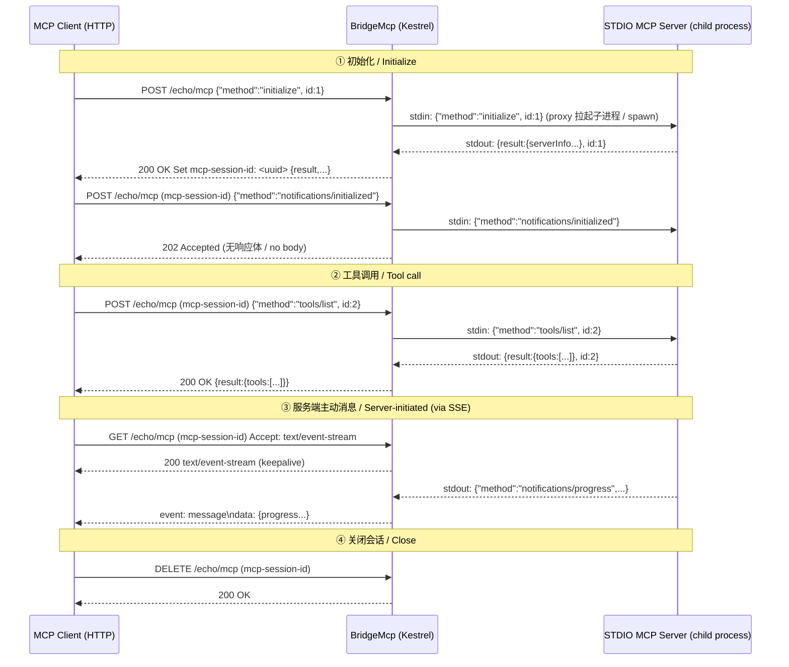
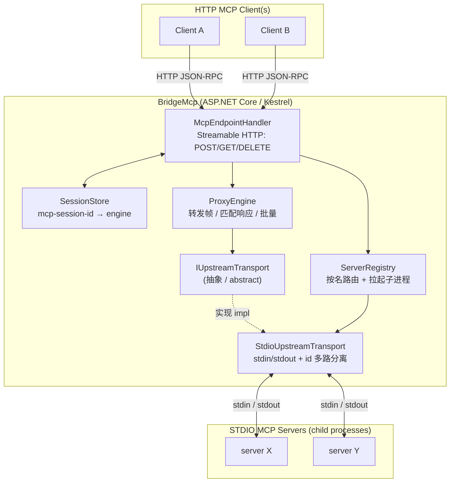
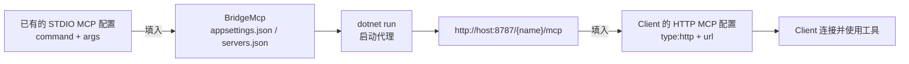
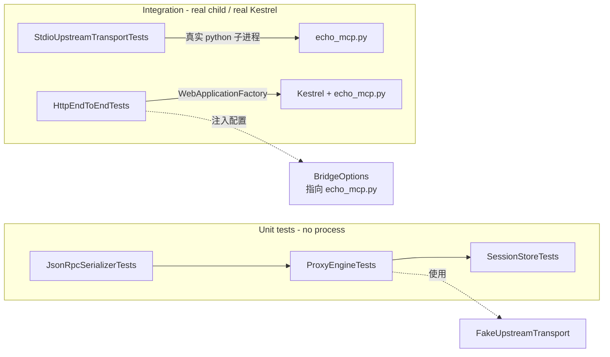
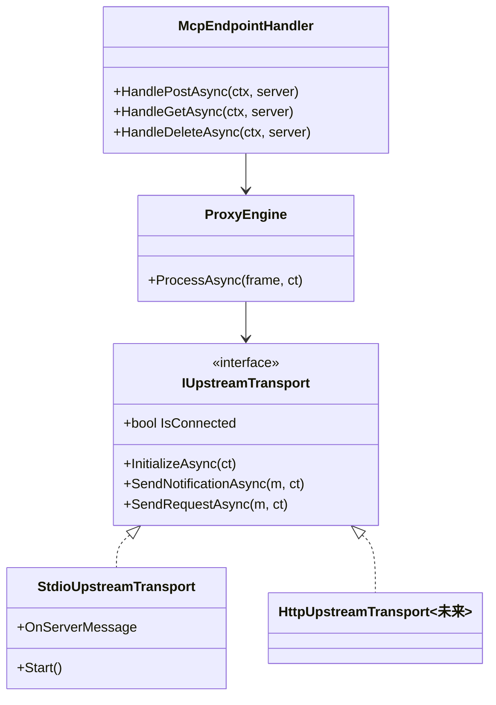

# BridgeMcp

> A proxy that exposes STDIO‑based [Model Context Protocol](https://modelcontextprotocol.io) (MCP) servers over the **Streamable HTTP** transport, so any HTTP‑capable MCP client can consume them.
>
> 一个把基于 STDIO 传输的 [Model Context Protocol](https://modelcontextprotocol.io) (MCP) 服务端，转换为 **Streamable HTTP** 传输对外暴露的代理工具，供所有支持 HTTP 的 MCP Client（如各类 Chat 客户端）直接使用。

[](https://dotnet.microsoft.com) [](LICENSE) [](#testing)

---

## 目录 / Table of Contents

- [为什么需要 / Why](#为什么需要--why)
- [工作原理 / How It Works](#工作原理--how-it-works)
- [架构 / Architecture](#架构--architecture)
- [快速开始 / Quick Start](#快速开始--quick-start)
- [配置 / Configuration](#配置--configuration)
- [在 Claude Code 中使用 / Using with Claude Code](#在-claude-code-中使用--using-with-claude-code)
- [HTTP API / 接口说明](#http-api--接口说明)
- [项目结构 / Project Structure](#项目结构--project-structure)
- [测试 / Testing](#测试--testing)
- [可扩展性 / Extensibility](#可扩展性--extensibility)
- [安全 / Security](#安全--security)
- [许可证 / License](#许可证--license)

---

## 为什么需要 / Why

Many excellent MCP servers are distributed as STDIO processes — you launch them with a `command` and `args`, and they speak JSON‑RPC over their stdin/stdout. This works great for local CLI hosts (like Claude Code), but **does not work** for clients that can only reach an MCP server over HTTP.

**为什么需要：** 很多优秀的 MCP 服务端都以 STDIO 进程的方式分发——通过 `command` + `args` 启动，在 stdin/stdout 上收发 JSON‑RPC。这对本地 CLI 宿主（如 Claude Code）很好用，但对**只能通过 HTTP 访问 MCP 服务端**的客户端则无法使用。

BridgeMcp bridges that gap: it spawns each configured STDIO MCP server as a child process and re‑exposes it as a spec‑compliant Streamable HTTP endpoint.

**BridgeMcp 就是这座桥**：它把每个配置好的 STDIO MCP 服务端作为子进程拉起，并按 MCP 规范以 Streamable HTTP 端点对外暴露。

---

## 工作原理 / How It Works

For every STDIO MCP server in your config, BridgeMcp:

1. Launches the child process and speaks JSON‑RPC 2.0 over its stdin/stdout (newline‑delimited).
2. Performs the MCP `initialize` handshake on your behalf when the first client connects.
3. Exposes a single HTTP endpoint `POST|GET|DELETE /{server}/mcp` that implements the [Streamable HTTP transport](https://modelcontextprotocol.io/specification/2025-06-18/basic/transports#streamable-http).
4. Demultiplexes concurrent client sessions — each HTTP `mcp-session-id` maps to the shared upstream connection, and responses are matched back to requests by JSON‑RPC id.
5. Relays server‑initiated messages (progress, sampling requests) onto a Server‑Sent Events (SSE) stream opened via `GET`.

**工作过程：** 针对配置中的每一个 STDIO MCP 服务端，BridgeMcp 会：① 以子进程拉起，通过 stdin/stdout 收发换行分隔的 JSON‑RPC 2.0；② 在首个客户端连接时替你完成 `initialize` 握手；③ 暴露单一 HTTP 端点 `POST|GET|DELETE /{server}/mcp`，实现规范的 Streamable HTTP 传输；④ 通过 `mcp-session-id` 区分并发会话，并用 JSON‑RPC id 把响应匹配回请求；⑤ 通过 `GET` 打开的 SSE 流，把服务端主动下发的消息（进度、sampling 请求）转发给客户端。

### 端到端交互时序 / End‑to‑end Sequence



---

## 架构 / Architecture

BridgeMcp is deliberately layered so that the JSON‑RPC forwarding logic is independent of both the HTTP wire and the upstream transport — each layer is unit‑testable in isolation and the upstream transport is pluggable.

**分层设计：** BridgeMcp 刻意分层——JSON‑RPC 转发逻辑既不依赖 HTTP，也不依赖具体的上游传输，每一层都可独立单测，上游传输可插拔。



### 分层职责 / Layer responsibilities

| 层 / Layer | 文件 / File | 职责 / Responsibility |
|---|---|---|
| **Protocol** | `Protocol/JsonRpcMessage.cs`, `Protocol/JsonRpcSerializer.cs` | JSON‑RPC 2.0 消息与帧（单条/批量）解析、分类、序列化，保留未知字段无损往返。 |
| **Transport** | `Transports/IUpstreamTransport.cs`, `Transports/StdioUpstreamTransport.cs` | 与上游 MCP 服务端的传输抽象及 STDIO 实现（子进程、按 id 多路分离、SSE 事件上抛）。 |
| **Core** | `Core/ProxyEngine.cs` | 传输无关的转发内核：单条/批量/通知路由，异常转 JSON‑RPC error。 |
| **Sessions** | `Sessions/ServerRegistry.cs`, `Sessions/SessionStore.cs` | 按名路由上游传输、管理 HTTP 会话。 |
| **HTTP** | `Http/McpEndpointHandler.cs` | Streamable HTTP 适配器，把帧接入 Kestrel。 |
| **Composition** | `Program.cs` | 配置绑定、鉴权与 Origin 校验、路由装配、优雅关停。 |

---

## 快速开始 / Quick Start

### 前置 / Prerequisites

- [.NET 10 SDK](https://dotnet.microsoft.com/download) (`dotnet --version` ≥ 10.0)
- 已安装的 STDIO MCP 服务端（如 `codebase-memory-mcp`、`markdown_rag` 等）

### 1. 编译 / Build

```bash
git clone <your-repo-url> bridge-mcp
cd bridge-mcp
dotnet build
```

### 2. 配置 / Configure

编辑 `src/BridgeMcp.Proxy/appsettings.json` 的 `Bridge:Servers`，或在同目录放一个 `servers.json`（Claude Code 风格）：

```jsonc
// src/BridgeMcp.Proxy/servers.json  (Claude Code 风格 / Claude Code style)
{
  "mcpServers": {
    "codebase-memory-mcp": {
      "command": "codebase-memory-mcp",
      "args": []
    },
    "markdown_rag": {
      "command": "E:/mcp-tools/mcp-markdown-rag/mcp-markdown-rag.exe",
      "args": []
    }
  }
}
```

> 两种风格等价：`Bridge:Servers`（完整字段）或顶层 `mcpServers`（Claude Code 风格，方便直接复用现有配置）。两者可同时存在，会合并。

### 3. 运行 / Run

```bash
dotnet run --project src/BridgeMcp.Proxy
# 默认监听 http://localhost:8787
```

访问根路径查看已暴露的服务端：

```bash
curl http://localhost:8787/
# {"name":"bridgemcp","version":"1.0.0","servers":[{"name":"codebase-memory-mcp","url":"/codebase-memory-mcp/mcp"}, ...]}
```

### 4. 快速验证 / Verify

```bash
# 初始化（拿到 mcp-session-id）
curl -i -X POST http://localhost:8787/markdown_rag/mcp \
  -H "Content-Type: application/json" \
  -d '{"jsonrpc":"2.0","id":1,"method":"initialize","params":{"protocolVersion":"2025-06-18","capabilities":{},"clientInfo":{"name":"test","version":"1.0"}}}'

# 带上返回的 mcp-session-id 继续调用
curl -X POST http://localhost:8787/markdown_rag/mcp \
  -H "Content-Type: application/json" \
  -H "mcp-session-id: <上一步返回的 id>" \
  -d '{"jsonrpc":"2.0","id":2,"method":"tools/list"}'
```

---

## 配置 / Configuration

配置通过 `appsettings.json` / `servers.json` / 环境变量加载。环境变量前缀为 `BRIDGEMCP_`。

| 字段 / Field | 说明 / Description | 默认 / Default |
|---|---|---|
| `Bridge:Url` | 监听地址（如 `http://localhost:8787`）。可用命令行 `--Bridge:Url="..."` 覆盖。 | `http://localhost:8787` |
| `Bridge:AuthToken` | 共享 Bearer Token；为空则不鉴权（仅建议本地使用）。 | `""` |
| `Bridge:AllowedOrigins` | 允许的 `Origin` 头（防 DNS rebinding）；为空则全部放行。 | `[]` |
| `Bridge:ProtocolVersion` | 向上游握手时声明、向客户端回写的协议版本。 | `2025-06-18` |
| `Bridge:Servers:{name}:Command` | 子进程可执行文件（绝对路径或 PATH 上可解析）。 | 必填 / required |
| `Bridge:Servers:{name}:Args` | 参数数组。 | `[]` |
| `Bridge:Servers:{name}:Env` | 子进程环境变量。 | `{}` |
| `Bridge:Servers:{name}:WorkingDirectory` | 子进程工作目录。 | 继承 / inherited |
| `Bridge:Servers:{name}:RequestTimeout` | 单个上游请求超时。 | `00:02:00` |
| `Bridge:Servers:{name}:ShutdownGraceSeconds` | 关停时等待子进程退出的宽限秒数。 | `5` |

**命令行覆盖 / Command-line overrides：** 所有配置项都可用 Kestrel 风格的 `--Key:SubKey=value` 覆盖，配置文件值会优先于 JSON 文件。常见用法：

```bash
# 指定监听端口（配置文件中 Bridge:Url 会被同名命令行参数覆盖）
bridgemcp.exe --Bridge:Url="http://localhost:6511"

# 传参到上游子进程 / argv for upstream child processes：
bridgemcp.exe --Bridge:Servers:markdown_rag:Args:0="--force-reindex"
```

> 优先级 / Precedence：环境变量 `ASPNETCORE_URLS` 与 `dotnet run` 的 `launchSettings.json` 注入是**最后兜底**；`--Bridge:Url`（命令行/配置）始终优先，`--urls` 仅在显式传入命令行时获胜。因此无论是发布后的 `bridgemcp.exe` 还是开发期的 `dotnet run -- --Bridge:Url=...`，端口都会按你的指定生效。

---

## 在 Claude Code 中使用 / Using with Claude Code

Claude Code 本身就能直连 STDIO MCP，所以**对本地 Claude Code，你通常不需要本代理**。BridgeMcp 的价值在于让那些「只能配 HTTP MCP Server」的客户端用上你的 STDIO MCP。

However, if you want Claude Code to consume the proxied server **over HTTP** (e.g. running BridgeMcp on one machine and pointing a remote Claude Code at it), configure an HTTP MCP server in Claude Code's settings (`~/.claude/settings.json` or the project's `.mcp.json`):

> 但若你想让 Claude Code **走 HTTP** 使用代理后的服务（例如把 BridgeMcp 跑在某台机器上，让远端 Claude Code 连过来），可在 Claude Code 的配置里加一个 HTTP 类型的 MCP server：

```jsonc
// ~/.claude/settings.json  或  .mcp.json
{
  "mcpServers": {
    "codebase-memory-mcp-http": {
      "type": "http",
      "url": "http://localhost:8787/codebase-memory-mcp/mcp"
    },
    "markdown-rag-http": {
      "type": "http",
      "url": "http://localhost:8787/markdown_rag/mcp"
    }
  }
}
```

若设置了 `Bridge:AuthToken`，Claude Code 的 HTTP MCP 配置需带 `headers`：

```jsonc
{
  "mcpServers": {
    "codebase-memory-mcp-http": {
      "type": "http",
      "url": "http://localhost:8787/codebase-memory-mcp/mcp",
      "headers": { "Authorization": "Bearer <your-token>" }
    }
  }
}
```

配置后重启 Claude Code，用 `/mcp` 命令即可看到已连接的服务端及其工具。

> 提示：Claude Code 对 `type: "http"` 的 MCP 会自动按 Streamable HTTP 规范完成 `initialize` 并管理 `mcp-session-id`，无需手动处理会话头。

### 生成配置流程 / Config bootstrap flow



---

## HTTP API / 接口说明

每个服务端对应一个端点 `/{server}/mcp`，遵循 MCP [Streamable HTTP](https://modelcontextprotocol.io/specification/2025-06-18/basic/transports#streamable-http) 规范。

| 方法 / Method | 用途 / Purpose | 说明 / Notes |
|---|---|---|
| `POST /{server}/mcp` | 发送 JSON‑RPC 请求/通知/批量。 | 首次 `initialize`（无 `mcp-session-id`）会创建会话，响应头回写 `mcp-session-id`。纯通知帧返回 `202`。 |
| `GET /{server}/mcp` | 打开 SSE 流，接收服务端主动消息与 keepalive。 | 需带 `mcp-session-id`。 |
| `DELETE /{server}/mcp` | 关闭会话。 | 需带 `mcp-session-id`。 |
| `GET /` | 健康检查 / 服务列表。 | 返回 `{name, version, servers:[...]}`。 |

**JSON‑RPC 错误码 / Error codes：** 透传上游错误；代理自身错误使用 `-32700`(解析) / `-32600`(非法请求) / `-32603`(内部) / `-32001`(上游超时)。

---

## 项目结构 / Project Structure

```
bridge-mcp/
├── src/BridgeMcp.Proxy/
│   ├── Configuration/BridgeOptions.cs      # 配置模型
│   ├── Protocol/JsonRpcMessage.cs          # JSON-RPC 消息模型 + 错误码
│   ├── Protocol/JsonRpcSerializer.cs        # 帧(单条/批量)解析与序列化
│   ├── Transports/IUpstreamTransport.cs     # 上游传输抽象
│   ├── Transports/StdioUpstreamTransport.cs # STDIO 实现(子进程+id多路分离)
│   ├── Core/ProxyEngine.cs                  # 传输无关转发内核
│   ├── Sessions/ServerRegistry.cs           # 按名路由+拉起子进程
│   ├── Sessions/SessionStore.cs             # HTTP 会话存储
│   ├── Http/McpEndpointHandler.cs           # Streamable HTTP 适配器
│   ├── Program.cs                           # 装配 + 鉴权 + 路由
│   ├── appsettings.json                     # 默认配置(含示例服务端)
│   └── servers.example.json                 # Claude Code 风格示例
├── tests/BridgeMcp.Proxy.Tests/
│   ├── Fakes/FakeUpstreamTransport.cs       # 内存式上游(测内核)
│   ├── Fixtures/echo_mcp.py                  # 真实 STDIO echo 服务端
│   ├── JsonRpcSerializerTests.cs             # 协议层单测(10)
│   ├── ProxyEngineTests.cs                   # 内核单测(7)
│   ├── SessionStoreTests.cs                  # 会话存储单测(4)
│   ├── StdioUpstreamTransportTests.cs        # STDIO 传输端到端(7)
│   └── HttpEndToEndTests.cs                  # HTTP 全链路(7)
├── BridgeMcp.sln
├── LICENSE                                  # Apache 2.0
└── README.md
```

---

## 测试 / Testing

```bash
dotnet test
```

全部 **35** 个测试通过，覆盖三个层次：

- **协议层 / Protocol layer** — JSON‑RPC 单条/批量/通知解析、错误码、无损往返（10 个）。
- **内核层 / Core layer** — `ProxyEngine` 转发、批量保序、通知无响应、上游错误透传、异常转 error（7 个，用 `FakeUpstreamTransport`）。
- **传输层 / Transport layer** — `StdioUpstreamTransport` 对真实 Python 子进程的握手、`tools/list`、`tools/call`、并发按 id 多路分离、非法命令报错（7 个）。
- **HTTP 层 / HTTP layer** — `WebApplicationFactory` 全链路：初始化建会话、完整流程、404/400/DELETE（7 个）。
- **会话存储 / Session store** — 4 个。

> 测试用到的 `echo_mcp.py` 是一个最小 STDIO MCP 服务端，会在构建时复制到输出目录。需要本机 `python` 在 PATH 中（已用 `-u` 无缓冲模式启动）。

### 测试与运行时配置 / Test & runtime wiring



---

## 可扩展性 / Extensibility

设计遵循「面向接口、分层解耦」原则：

- **新增上游传输类型 / New upstream transport：** 实现 `IUpstreamTransport`（例如 `HttpUpstreamTransport` 用于级联另一个 HTTP MCP、或 `InProcessUpstreamTransport` 用于内嵌服务端），在 `ServerRegistry.GetTransport` 按配置选择实现即可，`ProxyEngine` 与 HTTP 层无需改动。
- **新增传输协议 / New client transport：** `ProxyEngine` 与 HTTP 无关，未来可加 WebSocket / gRPC 适配器复用同一内核。
- **新增配置源 / New config source：** `BindOptions()` 集中绑定，可替换为任意 `IConfiguration` 提供者（Key Vault、Consul 等）。
- **并发模型 / Concurrency：** 上游传输是单连接、按 id 多路分离；HTTP 侧每会话独立 engine，天然支持多客户端并发。



---

## 已知问题：Windows 命令窗口弹窗 / Known issue: Windows console pop-ups

**现象 / Symptom：** 通过 HTTP 桥接调用某些 STDIO MCP 服务端时，会在桌面上弹出**多个命令提示符窗口**（`cmd.exe` / `git.exe`）。

**根因 / Root cause：** BridgeMcp 用 `CreateNoWindow` 拉起上游子进程，这对第一层子进程有效；但**孙进程不受 BridgeMcp 控制**。像 `codebase-memory-mcp` 这类 C/C++ 服务端在内部调用 `CreateProcessW` 拉 `git` / `cmd.exe` 等控制台程序时，**缺少 `CREATE_NO_WINDOW` 标志**。当父进程（桥服务）没有可继承的控制台（如运行在 IIS / 服务 / 无窗口宿主下）时，Windows 会为每个孙进程**新建一个可见控制台窗口** —— 每次工具调用都可能弹窗。

**避免 / Avoid & fix：** 修复应在**上游服务端**的 Windows 进程派生代码中加上 `CREATE_NO_WINDOW`。以 `codebase-memory-mcp` 为例，需要在三处 `CreateProcessW` 调用补标志：

- `src/foundation/compat_fs.c` —— `cbm_popen_isolated()` 走 `cmd.exe /c` 抓取 git 输出（**弹窗主源**，`git -C ...` 都经过它）
- `src/foundation/compat_fs.c` —— `cbm_exec_no_shell()`（cli 子命令）
- `src/foundation/subprocess.c` —— `cbm_win_spawn()`（watcher / 索引子进程）

改完重新编译上游二进制并重启桥即可。BridgeMcp 侧已确保 `UseShellExecute=false` + `CreateNoWindow=true`，无需改动。

---

## 安全 / Security

- 默认监听 `localhost`，不对外网暴露。
- 可选 Bearer Token 鉴权（`Bridge:AuthToken`）与 `Origin` 白名单（`Bridge:AllowedOrigins`），满足 MCP 规范的 DNS rebinding 防护建议。
- 上游子进程以代理进程身份运行，环境变量可单独配置。
- **生产部署 / Production：** 建议置于反向代理之后、开启 HTTPS、设置强 Token，并限制监听地址。

---

## 许可证 / License

Apache License 2.0。详见 [LICENSE](LICENSE)。

Licensed under the Apache License, Version 2.0 (the "License"); you may not use this file except in compliance with the License. You may obtain a copy of the License at <http://www.apache.org/licenses/LICENSE-2.0>.
